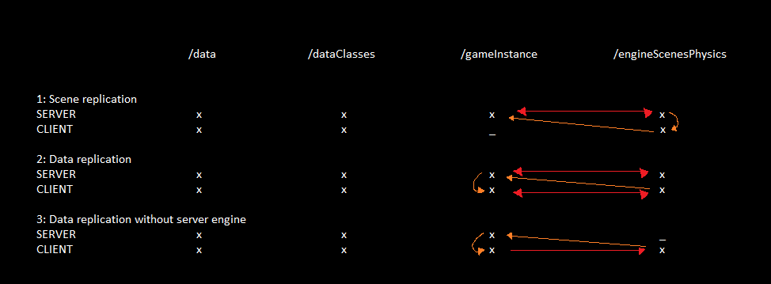

# 3 options:

## Data replication with engine on server (physics, ui, vfx)
- ClientEngine -> ServerData
- ServerData <-> ServerEngine
- ServerData -> ClientData
- ClientData -> ClientEngine

## Data replication without engine on server (no physics, ui, vfx)
- ClientEngine -> ServerData
- ServerData -> ClientData
- ClientData -> ClientEngine

## Engine replication
- ClientEngine -> ServerData
- ServerData -> ServerEngine
- ServerEngine -> ClientEngine

